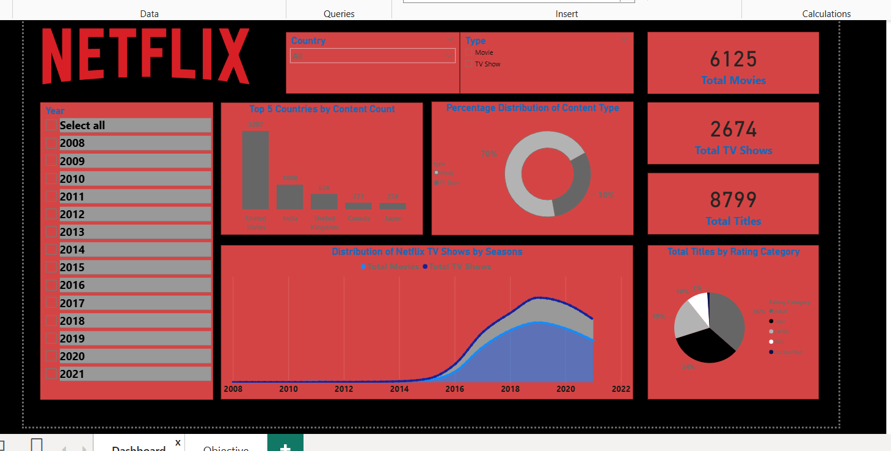

# Netflix Content Analysis Dashboard

##  Overview
This project analyzes Netflix’s movies and TV shows dataset to uncover key insights into content distribution, trends, and patterns over time.

The dashboard provides interactive visuals to explore:
- Movie vs TV Show distribution
- Country-wise content production
- Rating categories and trends
- Yearly content addition
- Duration and genre patterns

---

## 📊 Dataset
The dataset used is the “Netflix Titles” dataset (CSV), containing:
- Title
- Type (Movie/TV Show)
- Country
- Release Year
- Rating
- Duration
- Genre information

Source: Kaggle (Netflix Titles dataset)

---

## Tools Used
- Microsoft Excel & SQL (for data preparation and dashboard)
- Power BI (for interactive visualization)
- Power Query & DAX (for data transformation)
- Python (optional for preprocessing if used)

---

##  Dashboard Preview

---

## 🚀 Key Insights (Example)
- The number of TV Shows has grown faster than movies in recent years.
- The US and India are among top content contributors.
- Certain rating categories dominate overall shows.

---

## 📥 How to Use
1. Download the Excel/dashboard file from this repo.
2. Open it in **Microsoft Excel Desktop** or **Power BI Desktop**.
3. Enable slicers/filters to explore trends interactively.

---

## ⚡ Conclusion
This project demonstrates practical experience in data cleaning, analysis, and dashboard storytelling.

---

## 📎 About
Data analysis project built by **Kirti** — part of personal data analytics portfolio.

----
####  End

